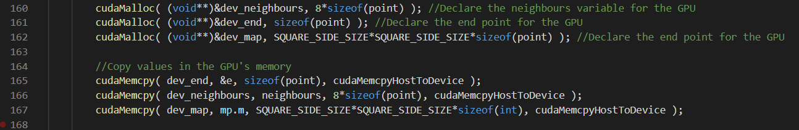
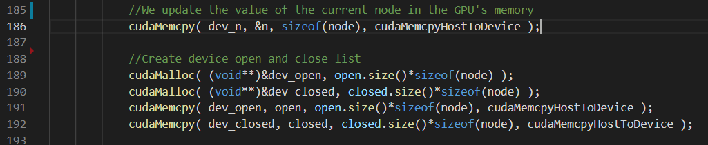
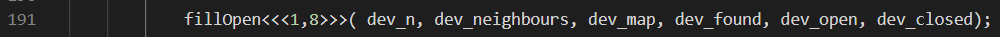
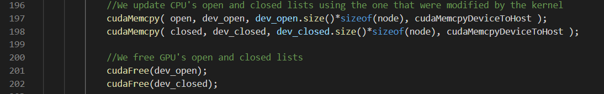
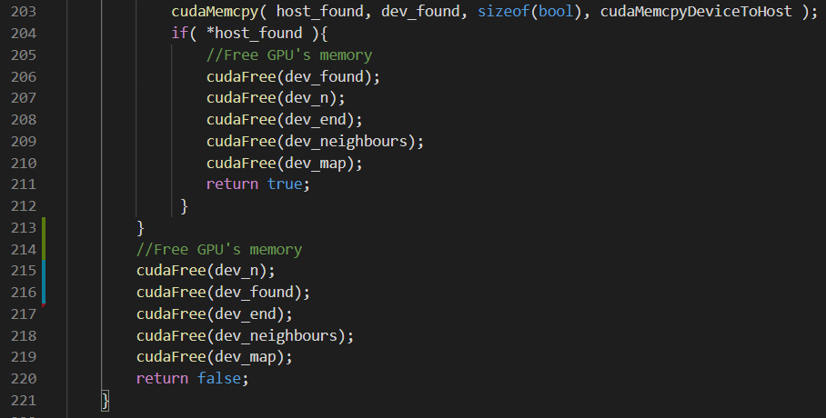

##### authors: Raphael BENISTANT, Laurent DEVEZ

# BE_Architecture: path finding *A\** algorithm CPU and GPU implementation

## Repository organization:

* **_Test\_CPU folder:_** contains several cpp files which corresponds to different implementation of the *A\** algorithm on CPU. Only the *rosetta_A_star.cpp* is fully functionnal.
* **_CPU\_final folder:_** contains our final version for the *A\** algorithm implementation on CPU.
* **_GPU\_final folder:_** contains our final version for the *A\** algorithm implementation on CPU + GPU.


## How to compile and execute source files:

* **_CPU_Final/rosettaA_star.cpp file:_** from this folder
```
cd ./Test_CPU
g++ -o rosettaA_star rosettaA_star.cpp
./rosrosettaA_star
```
* **_GPU_Final/rosettaA_star.cu file:_** from this folder
```
cd ./Test_GPU
nvcc -o rosettaA_star rosettaA_star.cpp
./rosrosettaA_star
```
## I - Introduction

In this repository we tried to implemented 2 version of the *A\** algorithm: one version optimized to run only on a CPU, and one version created to parallelize computations using an additional GPU.

### Explanation of the *A\** algorithm

In computer science, more precisely in artificial intelligence, the *A\** search algorithm is an algorithm for finding a path in a graph between a given initial node and an end node.
It is close to the Djikstra algorithm in its operation but unlike it, not all the points are covered.

#### Pseudo-algorithm

The basic structures that are manipulated for this algorithm are nodes. They are composed of 3 attributes: the actual position, a cost of the path to reach this position, and an estimation or an underestimation of the remaining cost to the final position.
We basically use two nodes lists called *open* and *closed* in order to carry out the path finding. The *open* list corresponds to the nodes that were explorated but not their neighbours and the *closed* list corresponds to the nodes that were covered as well as their neighbours. At the beginning of the algorithm we fill the *open* list with the initial position and then start to explore the neighbours. When a neighbour is not covered or when it presents a better heuristic than another node leading to the same position in the *open* or *closed* lists, we delete it in the list and add the new node in both lists. The new node represents the same position but was reached following a cheaper path regarding the cost.
The algorithm ends when the *open* list is empty, all the information regarding the cheaper path can then be found in the *closed* list.

*NB: the heuristic is the sum of the cost to reach this position and the remaining estimation to the final position. It is used to determine the best nodes to follow in order to minimize the cost of the path to reach the end position.*

## II - CPU and GPU implementation written in C++

### a) CPU version of the *A\** algorithm

We started from a C++ implementation we found on [rosettacode.org](https://rosettacode.org/wiki/A*_search_algorithm) and modified it in order to fit our needs.

We modified the sofware in order to be able to set any size of map, to be able to choose the percentage of hurdles in the map as well as the start point and the end point.

Configuration has to be made before compiling the software. Parameters corresponds to the different **#define** you can find at the beginning of the [main file](./CPU_final/rosettaA_star.cpp).

Once you set your parameters, you can then compile an run the sofware as shown earlier in this README.

### b) GPU version of the *A\** algorithm (not working)

Even though some software engineers thought tried to implement GPU versions of the *A\** algorithm, the way the algorithm works makes the parallelisation of tasks almost impossible. It was designed to run sequentially as it needs all the previous information about the already covered node to make comparisons. Both *open* or *closed* lists are constantly consulted and modified. If we parallelize the research, thread will not be aware of other threads information and redundancy search will be made. Simultaneous access to the *open* or *closed* lists also represents a big issue.

From our point of view, the only operations that could be parallelized were the exploration of the direct neighbours of a specific nodes, that is to say 8 operations for each node. Because the problems mentionned above, onlu one node can be processed at the same time.
Unfortunatly, we did not manage to make the code compile as the algorithm used a specific class called *list* which can not be manipulated using the GPU. However, we wrote the code as it should be if lists were allowed.

In order to implement our solution, we had to manage two different GPU types of variables in terms of memory behaviour. Some variables were static as their value does not change during the whole algorithm, and some variables were dynamic as their size and values were constantly changing during the execution. The picture below show the GPU's memory allocations for the static variables which are the end position, the map and the relative positions of the neighbours from any node:



Regarding the dynamic variables, the memory could not be allocated outside the *while* loop as they have to be freed dynamically and reallocated each time they are modified. The picture below shows the allocation for the dynamic variables which are basically both *open* or *closed* lists, the current tested node, and the *bool* result of the research:




*NB: as the* **dev_n** *and the* **dev_bool** *varibles always require the same amount of GPU memory, their allowations were made outside the* **while** *loop but their affectations within it.*

In a second time, we call our kernal to parallelize the tests of the 8 direct neighbours:



When all neighbours have been tested, CPU's *open* or *closed* lists are updated with the results of the kernel and GPU's memory for both *open* or *closed* lists is freed:



Finally, when the search function ends, we free all the remaining GPU memory even if we did not find a path from the initial position to the desired position.



## III - CPU's performances

As we wanted to compare performances of both version of the *A\** algorithm, we measured the execution tim of the CPU's version. We obviously did not do the same for the GPU's version as it does not work.

We measured the execution time for different sizes of map but using the same wall percentage which was 20%:
| **Size of the square map** | **Execution time** |
|:--------------------------:|--------------------|
| 10                         | 1165 us            |
| 100                        | 9422 us            |
| 1 000                      | 234274 us          |

## Conclusion

Trying to use GPU's architecture to accelerate the execution of the original sequential algorithm, we found out that the *A\** algorothm was not designed to allow parallelization. The way th algorithm works make it fully sequential even though some software engineers manage to release GPU versions of the algorithm. In order to parallelize the algorithm they had to modify the algorithm's behaviour as it requires all the past information of the research that you cannot have been shared between *threads* running simulatneously. Therefore, they had to developp mechanism to avoid redundancy in the research which were far beyond our capacities regarding the few hours we had to work on this project. One other big issue we coped with was that not all standard classes can be use with the GPU. As an example, *lists* are not handles by the GPU wich make it very painfull to manipulate dynamic lists. However I think we understood the advantages of using a GPU for other kinds of computation and the way to write appropriate software to do so. If the number of hours is not to be increased for the next years, maybe remove the *A\** algorithm from the list.
